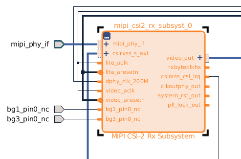

# [Place 20-687] MIPI_CSI2_rx be placed along with its associated I/O

## Environment

* Ubuntu 20.04 5.15
* Vivado 2018.03
* MIPI-rx 4.0
* ZCU106 board

## Error message

[Place 30-687] Expected cell zusys_i/mipi_rx/mipi_csi2_rx_subsyst_0/U0/phy/inst/inst/bd_db8e_phy_0_rx_support_i/slave_rx.bd_db8e_phy_0_rx_hssio_i/inst/top_inst/bs_top_inst/u_rx_bs/RX_BS[13].rx_bitslice_if_bs be placed along with its associated I/O. Please check if the cell is properly connected to any I/O. Please also check to make sure any BITSLICE in native mode has location constraints.

## Resolution

The error is caused by the unconnected **bg1_pin0_nc** and **bg3_pin0_nc**.
Create a port for each pins will solve the issue.
Don't need modify the constraints file for the above ports.

