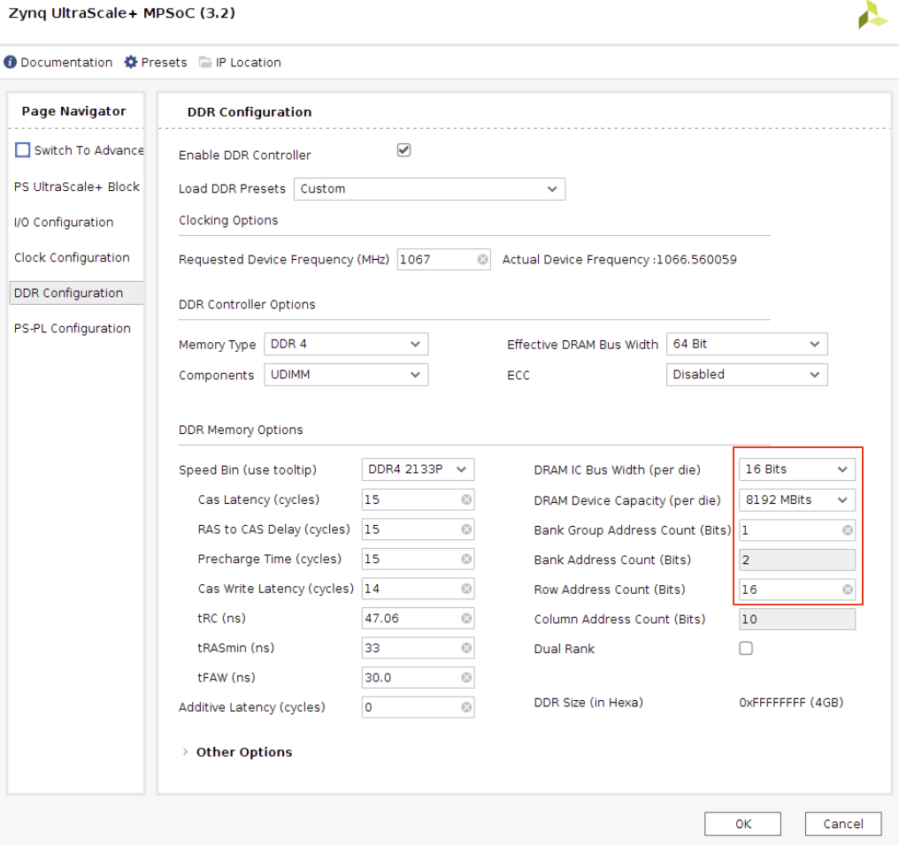

# Baremetal boot hang at **SynchronousInterruptHandler**

## Environment

* Ubuntu 20.04 5.15
* Vivado 2018.03
* MIPI-rx 4.0
* ZCU106 board labeled 0432032-02

## Error message

In baremetal mode, the boot of mpsoc is hanged at 'b SynchronousInterruptHandler'. This insturction jumps to the initiailization of the interrupt controller of arm processor.

## Resolution

Xilinx [AR7161](https://support.xilinx.com/s/article/71961?language=en_US) gives the solution to update the memory interface setup in the block diagram.

